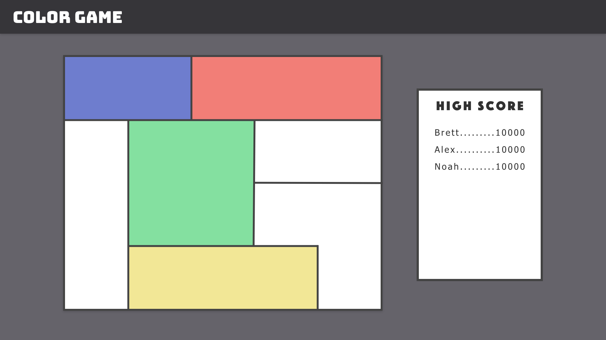
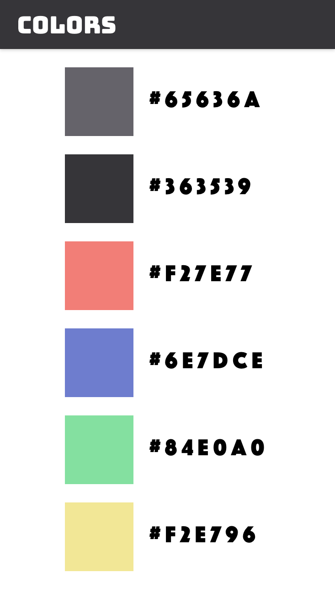

# Color Game

## Framework

We will be using CreateJS as a framework to develop ColorGame. This is a suite of JavaScript libraries which allow us to draw, animate, play audio, and manage asset loading. Primarily we will use EaselJS to handle the drawing of graphics on the screen,
but may use other libraries in the CreateJS suite as needed/desired

https://www.createjs.com/

## Webhosting & CI/CD pipeline

TBD

## Design

